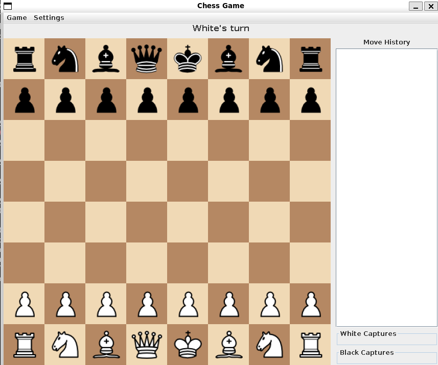
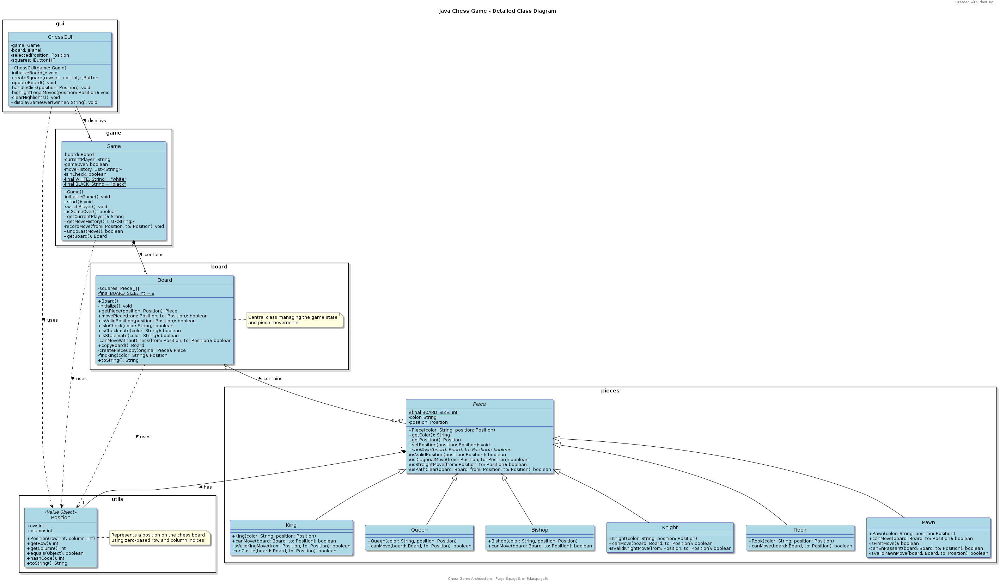

# Java Chess Game

## Team Information
- **Team Name**: LiChessBot
- **Team Members**: 
  - lolout1
- **Course**: CS 3354
- **Semester**: Fall 2023
- **Section**: [Your Section Number]

## Project Overview
A fully functional GUI-based chess game implemented in Java, featuring complete chess rules implementation including move validation, piece capture, check and checkmate detection.

## Preview

<!-- Add your game interface screenshot here -->

## Class Diagram

<!-- Add your UML class diagram here -->

## Features
- [x] Complete chess rules implementation
- [x] Graphical User Interface
- [x] Move validation
- [x] Piece capture
- [x] Check detection
- [x] Checkmate detection
- [x] Turn-based gameplay
- [x] Game state visualization
- [ ] Save/Load game functionality
- [ ] Move history
<!-- Add or modify features as implemented -->

## How to Run
1. **Prerequisites**:
   - Java JDK 11 or higher
   - Java IDE (Eclipse, IntelliJ IDEA, or similar)

2. **Compilation**:
   ```bash
   javac -d bin src/**/*.java
   ```

3. **Running the Game**:
   ```bash
   java -cp bin main.ChessGame
   ```

## Game Instructions
1. Launch the game using the instructions above
2. Click on a piece to select it
3. Valid moves will be highlighted
4. Click on a highlighted square to move the selected piece
5. Game automatically detects check and checkmate conditions
6. Players alternate turns until checkmate or stalemate

## Development Notes
- Backend chess logic integrated with GUI
- Move validation implemented for all piece types
- Check and checkmate detection fully functional
- Multiple commits with clear documentation
- Well-commented code structure
